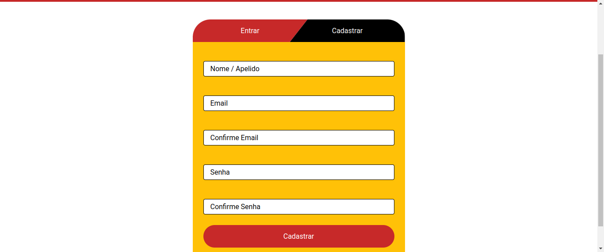

# Monte seu Sanduíche

Uma Web Aplicação feita como avaliação para o módulo React I do curso Web Fullstack da Let's Code - Escola de Programação.

EN: A Web App made as a knowledge assesment for the React I module of the Web Fullstack Course taught at Let's Code - Programming School.

## Descrição do Projeto | Project Description

O App trata-se de um front-end para uma e-commerce de lanches com página de cadastro e login, montagem do lanche(s), carrinho e pagamento.

No projeto foram usados React + React-Dom pela facilidade de componentização das diversas partes do app, React Router v6 para roteamento entre as vistas do app, Google Firebase para cadastro e login de usuários e Sass para estilização dos componentes.

O App é responsivo e feito com uma abordagem mobile-first.

Acesse a [versão live](https://monta-sanduiche.netlify.app/).

EN: The App is a front-end for a fastfood e-commerce with pages for log-in and sign-up, making the snack order, cart and payment.

The project was made with React + React-Dom for ease with componentizing the various parts of the app, React Router v6 for routing between views, Google Firebase for sign-up and log-in capabilities and Sass for styling of the components.

The App is responsive and made with a mobile-first approach.

Access the [live version](https://monta-sanduiche.netlify.app/).

## Instruções | Instructions

- Dê fork neste repositório | EN: Fork this repository
- Clone a sua versão do repositório | EN: Clone your version of the repository
- Use o comando a seguir para instalar as dependências necessárias | EN: Run the following command to install the required dependencies

```
npm update
```

- Use o comando a seguir para rodar uma versão local do app | EN: Run the following command to get a local version of the app

```
npm start
```

O app estará disponível em [http://localhost:3000](http://localhost:3000)
EN: The app can be accessed at [http://localhost:3000](http://localhost:3000)

- Use o comando a seguir para empacotar o app | EN: Use the following command to bundle the app

```
npm run build
```

O pacote será otimizado para o modo de produção para ter a melhor performance.
EN: It correctly bundles React in production mode and optimizes the build for the best performance.

## Como User | How to Use

### Navegação | Navigation

Todas as paginas utilizam o mesmo cabeçalho contendo os links de navegação para as diversas sessões do app.
Usuários autenticados tem acesso a todas as sessões do app, exceto página de cadastro/login. Usuários não autenticados tem acesso apenas a página de cadastro/login.

- Montar Sanduíche:
  Direciona a página para escolher seu lanche.

- Pagamento:
  Direciona a página para pagar pelos lanches selecionados.

- Seu Carrinho:
  Direciona a página para organizar seus pedidos (aumentar ou diminuir quantidades, excluir pedidos).

- Entrar (Sair):
  Direciona a página de cadastro/login se o usuário não estiver autenticado. Desaltentica o usuário caso este esteja autenticado.

EN:

All pages utilize the same header containing all the navigation links for all parts of the app.
Authenticated users have access to all app pages, except the sign-up/log-in page. Unauthenticated users have access only to the sign-up/log-in page.

- Montar Sanduíche (Build Sandwich):
  Links to the page where the user will make his order.

- Pagamento (Payment):
  Links to the page where payment is processed.

- Seu Carrinho (Cart):
  Links to the cart page where the user will organize his order (increase and decrease quantities, delete parts of the order)

- Entrar/Sair (Log-in/Log-out):
  Links to the sign-up/log-in page if the user is unauthenticated and logs the user out if authenticated.

### Cadastro e Login | Sign Up and Log In

Possui duas abas:

#### Entrar (aba de login)


- Possibilita duas formas de autenticação: por conta google ou por conta cadastrada na aba de cadastro
- Campos de entrada irão mostrar erros individuas apenas após perder o foco pela primeira vez ou após clicar no botão "Entrar"
- Se houver algum erro no processo de autenticação mesmo com os campos estando com formato correto, será mostrado um erro geral acima do botão "Entrar" informando o que ocasionou o erro.

#### Cadastrar



- Possibilita o cadastro de uma conta utilizando email e senha através do google firebase authentication.
- O cadastro não exige email de confirmação para facilitar o teste (porém é má prática)
- Campos de entrada irão mostrar erros individuas apenas após perder o foco pela primeira vez ou após clicar no botão "Cadastrar"
- Se houver algum erro no processo de cadastro mesmo com os campos estando com formato correto, será mostrado um erro geral acima do botão "Cadastrar" informando o que ocasionou o erro.

### Montar Sanduíche | Make Your Order


- Divide o pedido em 5 etapas: pão, recheio principal, queijo,
  saladas e complementos.
- As três primeiras etapas são obrigatórias e permitem apenas uma escolha. As duas últimas permitem mais de uma opção ser selecionada e não são obrigatórias.
- Cada vez que um ingrediente é selecionado, a cor da opção muda para dourado e ela é adicionada à lista que registra todos os ingredientes selecionados e o preço é reajustado automaticamente.
- Para passar para uma proxima etapa deve-se clicar no botão
  "Prosseguir".
- Caso o botão "Prosseguir" não esteja mostrado na tela (como no caso de um usuário mobile), um botão flutuante aparecerá no canto inferior da tela logo após o usuário selecionar uma opção. O botão flutuante aparecerá automaticamente para opções que não são obrigatórias.
  
- Ao finalizar o pedido, deve-se clicar no botão "Adicionar ao Carrinho", que adicionará o pedido ao carrinho e encaminhará o usuário ao carrinho para visualizar todos os pedidos no carrinho.

### Seu Carrinho | Your Cart


- Mostra todos os pedidos.
- Cada pedido individual mostra os ingredientes selecionados, preço e opções para aumentar ou diminuir a quantidade ou excluir o pedido do carrinho.
- Caso um pedido feito seja adicionado ao carrinho e já exista um pedido igual no carrinho, a quantidade do pedido já existente será aumentada em uma unidade.
- A pagina apresenta duas opções de navegação: "Continuar Comprando" direciona para a página de fazer pedidos e "Finalizar Pedido" direciona para a página de pagamento do pedido atual que está no carrinho.
- Caso a página seja acessada através do link no cabeçalho da página e não houve nenhum pedido, a página indicará que nenhum pedido foi realizado.
- Ao fechar o site ou deslogar, os pedidos do usuário ficaram salvos para uma próxima sessão no localStorage da máquina.
- Usuários diferentes da mesma máquina não terão acesso ao carrinho um do outro, pois o carrinho é ligado também a conta através do user id único fornecido pelo firebase authentication.
- O carrinho atual será apagado tanto do localStorage quanto do site assim que o pedido for pago ou quando for excluído diretamente pelo usuário.

### Pagamento | Payment


- Caso o usuário acesse a página de pagamento sem ter feito um pedido, a página informará que nenhum pedido foi feito.
- O Botão "Pagar" só será liberado para ser clicado quando todos os campos do formulários de pagamento estiverem preenchidos corretamente e houver um pedido.
- Os campos do formulário apresentam uma mensagem de erro (se necessário) apenas após perderem foco pela primeira vez.
- Ao clicar em pagar e o pagamento for aprovado, a pagina abrirá um modal indicando sucesso da operação.
- Ao clicar em pagar e o pagamento for recusado (caso de teste em que o número do cartão é 111111111111), a paginá abrirá um modal indicando o fracasso da operação.
- Os modais podem ser fechados clicando no botão disponibilizado no próprio modal ou clicando fora do modal.
  

### Sair | Log-Out

- Desautentica o usuário
- Redireciona para a página de cadastro/login
